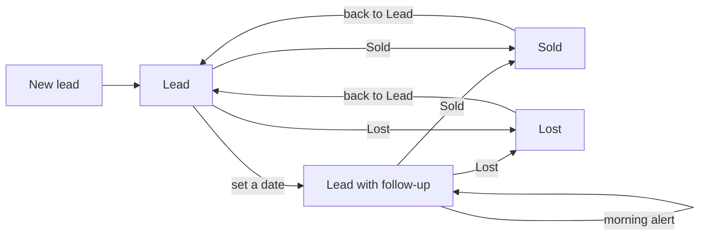
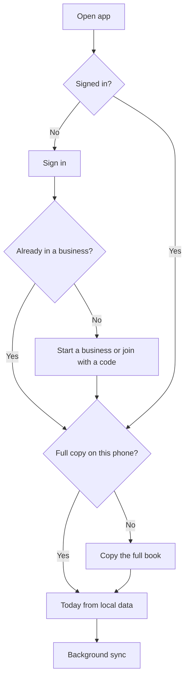
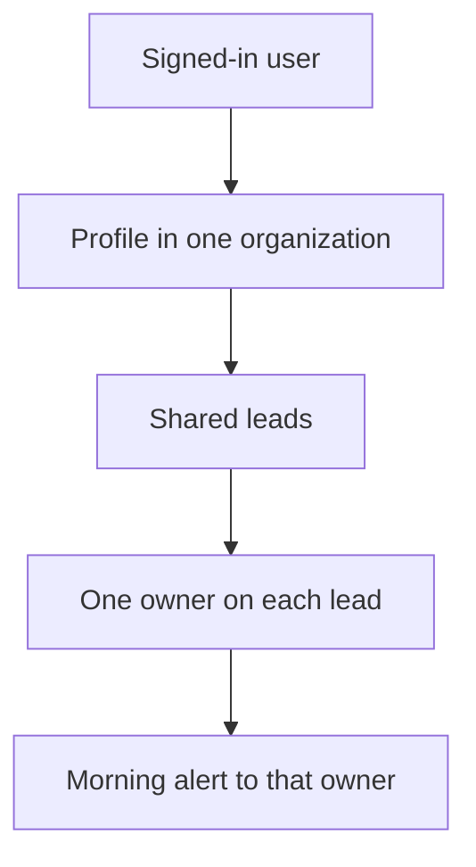

# BPH CRM

BPH is a mobile CRM with four jobs: keep a lead, remember the follow-up date, and mark it Sold or Lost. It is shared by a small team. The phone keeps a full copy of the book so the app opens immediately, including offline. Supabase is the shared database.

This document is the product and technical plan. The live styles are in `apps/web/src/styles.css`.

## Decisions

1. One business has one shared book. Every member can see and edit every lead.
2. A lead has one status: **Lead**, **Sold**, or **Lost**.
3. A follow-up is a calendar date on a Lead. It is not a status.
4. Each lead has one owner. The owner defaults to the person who created it. Only the owner gets push alerts for that lead.
5. **Today** opens on the signed-in person's follow-ups. An **All** switch shows the whole team.
6. Follow-ups are dates, not times. The alert is a morning digest at a local time the person chooses. The default is 8:00.
7. The app stores its working copy in IndexedDB on the device. The first successful sign-in on that phone copies the whole book, then every screen reads and writes the local copy.
8. The phone does not upload anything until that first copy finishes. An empty local database cannot overwrite the team book.
9. If someone else changed the lead first, the server copy stays and the app asks you to redo your edit.
10. The layout is one column. On a large screen that column sits in the center.
11. Marking Sold or Lost clears the follow-up date, which stops reminders.
12. A new lead defaults its follow-up to tomorrow. The person can clear it.
13. Each person belongs to one business in the first version.
14. The visual theme is light. The book is used in daylight.
15. If nothing is overdue and nothing is due today, BPH sends no notification that morning.

## Who it is for

A small sales team that works from their phones. They call a person, agree to talk again on a date, and later mark the outcome. They do not need pipelines, custom fields, invoices, or campaigns.

## Lead lifecycle



Returning a Sold or Lost lead to Lead clears the closed date. The old follow-up is not restored. The person sets a new date.

A Lead with no date stays in the Leads list and never appears on Today, and it never sends an alert. The new-lead form says so.

## How a day works

1. Open BPH. Today is already on screen from the phone's copy.
2. Overdue leads are first, then anything due today, then the next 7 days.
3. Call from the row. Open the lead to mark Sold, Lost, or a new date.
4. At the chosen morning time, the owner gets one alert if they have anything overdue or due that day.
5. The rest of the team sees the same change after sync.

## Information architecture



Three tabs:

| Tab | Purpose |
| --- | --- |
| Today | Overdue, due today, and the next 7 days |
| Leads | The whole book, split into Lead, Sold, and Lost |
| You | Profile, team, reminders, sync |

Pushed screens hide the tab bar: lead detail, new lead, edit lead, sign in, start, join, and the first-copy screen.

The add button is on Today and Leads.

## Screens

### Sign in

Email and password. One primary button. Links to create an account, start a business, and join with a code. Supabase Auth handles the session. After the session exists, the app refreshes it when online. Local data stays readable if refresh fails. Uploads wait until the session is valid again.

### Start a business

Business name and the person's name. This creates the organization, an owner profile, and an invite code.

### Join with a code

Invite code and the person's name. The code is an 8-character unambiguous string. Attempts are rate-limited. The owner can regenerate the code from You. A person who already belongs to a business cannot join a second one in this version.

### First copy

Blocking, once per phone, only while the network copy has never finished.

- Title: Copying the full book onto this phone
- Body: BPH opens from this copy so the app stays instant. This happens once on each phone.
- Progress, then the lead count, then Today.

Failure stays on this screen: "Couldn't finish. Check your connection and try again." with Retry. The app does not continue with an empty book.

Later launches skip this screen and paint Today from IndexedDB in the same tick as startup.

### Today

Header shows **BPH** and the sync word: **Synced**, **Syncing…**, or **Saved on this phone** when offline.

Under the date, a scope switch: **Mine** (default) and **All**.

Summary line uses the same words as the push alert, for the current scope:

- `1 due today · 1 overdue`
- `2 due today`
- `1 overdue`

Sections, in order, hidden when empty:

1. **Overdue** — follow-up date before today, oldest first
2. **Due today** — follow-up date is today
3. **Later** — follow-up date within the next 7 days

Each row shows the person's initials, name, due label, and **Call**. The row opens the lead. If the owner is someone else, their name is on the row.

If Mine has nothing overdue and nothing today, the empty line is: "Nothing overdue or due today." Later rows still show when they exist.

A lead with a follow-up more than 7 days away is not on Today. A text button sends you to Leads.

### Leads

Search by name or phone. Segments: **Lead**, **Sold**, **Lost**, each with a count.

Open leads sort by follow-up date, empty dates last. Sold and Lost sort by closed date, newest first. The secondary line is the due label, "No follow-up", or "Sold · 25 Sep" / "Lost · 25 Sep".

### Lead

Large name, then the status control: Lead, Sold, Lost. One tap writes locally.

Follow-up block shows only while the status is Lead: the date, quick choices (Tomorrow, In 3 days, Next week, No date), and a date field. Saving a date is immediate.

Call and WhatsApp show when a phone number exists. Call uses `tel:`. WhatsApp uses `https://wa.me/` with digits only.

Owner is a field with teammates' names. Changing it changes who gets the alert.

Meta line: "Last change · Nadia · 2h ago".

**Edit** opens name, phone, notes, and owner.

**Delete lead** is a bottom sheet. Delete is a soft delete. The lead disappears for the whole team after sync.

### New lead

Name (required), phone, follow-up, notes, owner. Follow-up starts on tomorrow. Chips: Today, Tomorrow, In 3 days, Next week, No date. Helper text: "Without a date, BPH will not remind anyone."

Save returns to the new lead. The list already contains it before the network answers.

### You

- Signed-in name and role
- Business name
- Teammates
- Invite code and copy
- Reminders: on or off, and the local time (7:00, 8:00, 9:00, or 18:00)
- A preview of that person's own morning alert
- Install note: on iPhone, add BPH to the Home Screen so alerts can arrive while the app is closed
- Sync: "BPH keeps the full book on this phone. Changes show up right away, then sync to the rest of the team."
- Sign out

Sign out clears the local book after the outbox is empty, or warns if uploads are still waiting.

## Visual design

Spacing, type, and color live in `apps/web/src/styles.css`. Tokens:

| Token | Value | Use |
| --- | --- | --- |
| Paper | `#EFECE4` | App background |
| Card | `#FFFDF8` | Lists and sheets |
| Ink | `#1B1916` | Primary text |
| Muted | `#433E39` | Secondary text |
| Line | `#DDD6CA` | Hairlines |
| Green | `#1F4D3A` | Primary buttons, Sold, Call |
| Green soft | `#E5F2EB` | Call background |
| Due | `#8A4E10` | Due today |
| Overdue | `#8E2F28` | Overdue and delete |
| Lost | `#433E39` | Lost |

Type is Manrope, with a system sans fallback. Titles are 32px. Inputs are 16px so mobile browsers do not zoom. Tap targets are at least 44px. Status is always a word plus a color.

Cards are flat, 18px radius, separated with a hairline. The add button is a 56px green circle above the tab bar.

Sync and status are never color alone. The header uses the words Synced, Syncing…, and Saved on this phone.

## Notifications

In-app is the guarantee. Today is the list, and the Today tab badge is the count of **my** overdue plus **my** due-today leads. When the app is installed, `navigator.setAppBadge` gets that same count.

Push is one digest per owner per morning:

| | |
| --- | --- |
| Title | Follow-ups |
| Body | `1 due today · 1 overdue` |
| Tap | Opens Today on Mine |

Body rules:

- both counts: `{today} due today · {overdue} overdue`
- only today: `{today} due today`
- only overdue: `{overdue} overdue`
- neither: send nothing

"Today" is the calendar date in the profile timezone:

```sql
(now() at time zone profiles.timezone)::date
```

`follow_up_on` is a `date`. An hourly job invokes a Supabase Edge Function. The function loads members whose local hour matches `notify_minute`, counts that owner's open leads, and sends Web Push only when the count is non-zero. VAPID keys stay on the server. The browser stores the push subscription in `push_subscriptions`.

Permission is requested from You, or from a card on Today after the first follow-up exists. The card is not a blocker. If permission is denied, Today still works and You says reminders are off.

iOS sends web push only to a Home Screen web app on iOS 16.4 or later. Android Chrome can notify from the browser and from the installed app. The copy on You says this plainly.

## Local-first sync

### Why the first load copies everything

The phone is the thing the salesperson is holding, often on a weak connection. After one complete download, lists, search, status changes, and new leads hit IndexedDB and paint immediately. Supabase catches up in the background and is the copy the rest of the team reads.

"Full database migration on first load" means this one-time hydration of the organization's rows. SQL schema changes are a separate path: Supabase migrations when the backend ships, and a Dexie version upgrade for the local tables.

### Local tables

Database name: `bph`.

| Table | Contents |
| --- | --- |
| `meta` | `orgId`, `userId`, `fullSyncComplete`, `cursor` (server timestamp) |
| `leads` | The book, including fields needed to render every screen |
| `profiles` | Teammates in the business |
| `outbox` | Mutations not yet acknowledged |

UI code reads `leads` through a live query. It does not wait on `fetch` to render a screen.

### First copy

1. Read `now()` from Supabase. Call that `startedAt`.
2. Page through every lead and every profile in the organization, ordered by `updated_at`, about 1,000 rows per request. Include soft-deleted leads so this phone learns about removals.
3. Write each page into IndexedDB inside a transaction.
4. Pull again where `updated_at >= startedAt` to catch edits that happened during the copy.
5. Set `cursor` to a new server `now()`, set `fullSyncComplete`, then open Today.

Uploads stay disabled until step 5. There is no "sync empty local state upward" path.

### Steady state

Writes:

1. Write the lead locally and update the screen.
2. Coalesce that lead's pending outbox item into one patch. Keep the `baseVersion` from before this phone's offline edits.
3. When online, `update leads set ... where id = ? and version = baseVersion`.
4. A database trigger sets `updated_at` and increments `version`.
5. On one updated row, mark the outbox item done and store the server version.
6. On zero rows, fetch the server lead, replace the local row, drop the outbox item, and tell the person: "This lead was updated by Nadia. Your change was not saved."

Pull:

- Subscribe to Supabase Realtime `INSERT` and `UPDATE` on `leads` and `profiles` for this organization. Realtime follows the same row-level security as the API.
- On foreground, and about every 30 seconds while the app is visible, pull `updated_at > cursor`.
- Apply a `deleted_at` value by removing the local lead.
- Move `cursor` forward only after the page is stored.

A lead deleted on the server while this phone has a pending edit shows: "This lead was deleted." The local row and outbox item are dropped.

Offline header copy is **Saved on this phone** while the outbox has items, and **Synced** when it is empty and the last pull succeeded.

### Clock skew

`updated_at` and `version` are written by the database, not by the phone. The client may store a local `updatedAt` for display until the ack returns, then replace it with the server value.

## Multi-user model



Roles are owner and member. Both can create, edit, reassign, and soft-delete leads. The owner can regenerate the invite code and remove a member. Removing a member reassigns their leads to the owner and sets `removed_at` on the profile. The row stays so older leads can still show that person's name, and `current_org_id()` ignores removed profiles so they lose access. That same login cannot join a second business. A member cannot change their own role or business; that trigger blocks it.

Auth screens and these rules are the whole account model. There are no workspaces beyond the one business, and no per-lead privacy.

## Data model

The planned schema is `docs/schema.sql`. It is the contract for the first Supabase migration. It is not applied yet.

Leads:

| Column | Notes |
| --- | --- |
| `id` | UUID, generated on the phone for new leads so offline create works |
| `org_id` | Business |
| `name` | Required, 1–120 characters |
| `phone` | Optional, up to 40 characters |
| `notes` | Optional, up to 2,000 characters |
| `status` | `lead`, `sold`, or `lost` |
| `follow_up_on` | Date, only while status is `lead` |
| `closed_on` | Date, empty while status is `lead` |
| `owner_id` | Who is reminded |
| `created_by`, `updated_by` | Profiles |
| `version` | Integer, conflict check |
| `created_at`, `updated_at` | Server timestamps |
| `deleted_at` | Soft delete tombstone |

Checks:

- Sold and Lost cannot have `follow_up_on`.
- A Lead cannot have `closed_on`.
- `owner_id` must be a profile in the same organization.

`create_org` and `join_org` are `security definer` functions. A new account has no profile yet, so row-level security cannot see the organization until the function writes the profile. The functions use `auth.uid()` and reject a second organization.

Clients never receive the service-role key.

## Stack

| Piece | Choice |
| --- | --- |
| App | Vite, React, TypeScript |
| UI | The tokens and layout in `apps/web/src/styles.css` |
| Local database | Dexie (IndexedDB) |
| Server | Supabase Auth, Postgres, Realtime, Edge Functions |
| Dates | Calendar dates in local civil time, compared as `YYYY-MM-DD` |
| Installable app | `vite-plugin-pwa` |
| Push | Web Push from the digest function |

The app does not take a second sync vendor. One table matters, and the outbox above is the whole protocol.

Suggested shape when implementation starts:

```text
apps/web/src/screens
apps/web/src/db
apps/web/src/sync
apps/web/src/notifications
supabase/migrations
supabase/functions/followup-digest
```

Environment:

| Name | Where |
| --- | --- |
| `VITE_SUPABASE_URL` | Client |
| `VITE_SUPABASE_ANON_KEY` | Client |
| VAPID public key | Client, used only to subscribe |
| VAPID private key | Edge Function secret |

## Build order

1. **Shell.** App frame, tabs, Today, Leads, lead detail, new lead, and the visual tokens.
2. **Accounts.** Supabase Auth, `create_org`, `join_org`, profiles, invite code, row-level security.
3. **Local copy.** Dexie, the blocking first copy, optimistic writes, outbox, version conflicts, realtime, and the foreground pull.
4. **Reminders.** Permission, subscription storage, hourly digest, badge count, quiet mornings when nothing is due.
5. **Install.** Web app manifest, service worker, Home Screen note, offline header, sign-out rules.

## Acceptance checks

- Relaunch with a finished copy paints Today without a network round trip.
- Airplane mode: add a lead, mark Sold, set a date. The lists update immediately. The header says Saved on this phone. Reconnecting uploads the coalesced edits.
- A second phone sees those edits through realtime without a reload.
- Two offline edits to the same lead on one phone send one update.
- Two phones editing the same lead: the first upload wins, the second shows the redo message, and the loser's copy is not written.
- Sold and Lost leads are absent from Today and from the digest.
- Digest body matches the Today summary for Mine.
- A morning with zero overdue and zero due-today leads sends no push.
- A deleted lead disappears on the other phone.
- A member only receives rows for their organization.
- First copy failure never uploads an empty book.
- iPhone Safari and a narrow Android viewport: 44px targets, no input zoom, tab bar clear of the home indicator.

## Out of scope

Custom fields, pipelines, companies as separate records, attachments, email or SMS campaigns, reporting beyond the Today counts, multi-organization membership, dark mode, and a desktop split view.

WhatsApp is a link from the phone number, not an integration.
